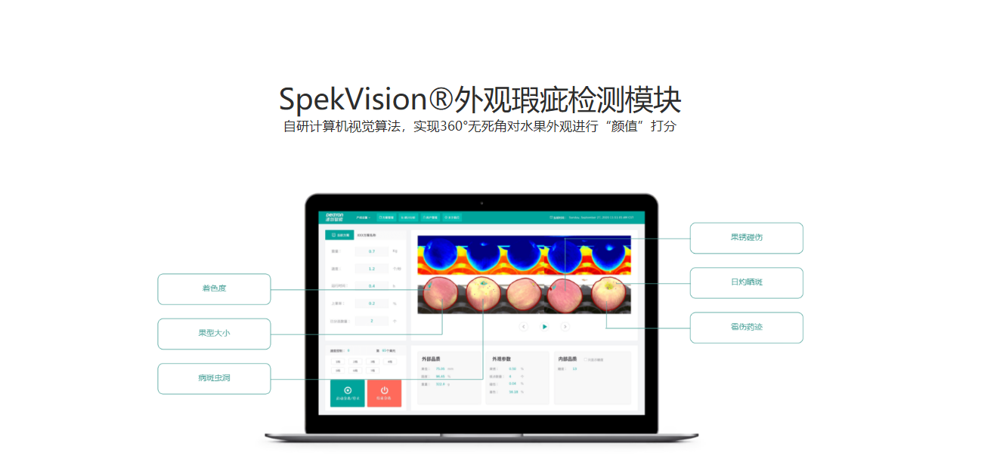
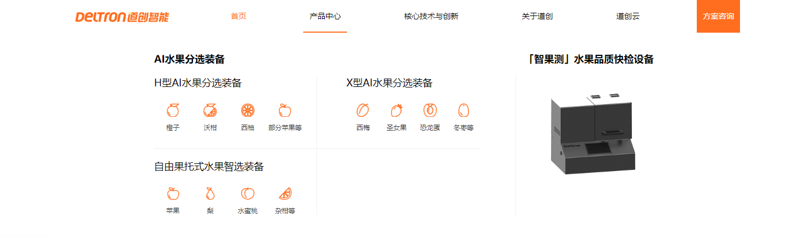
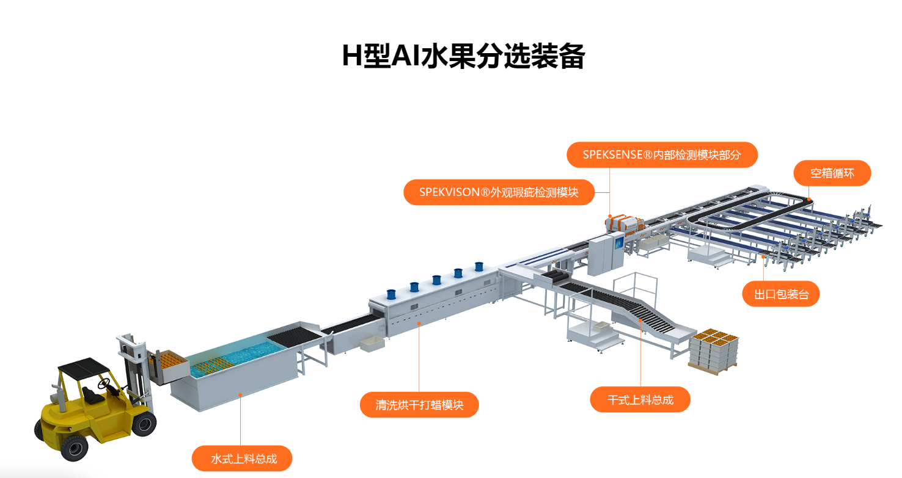
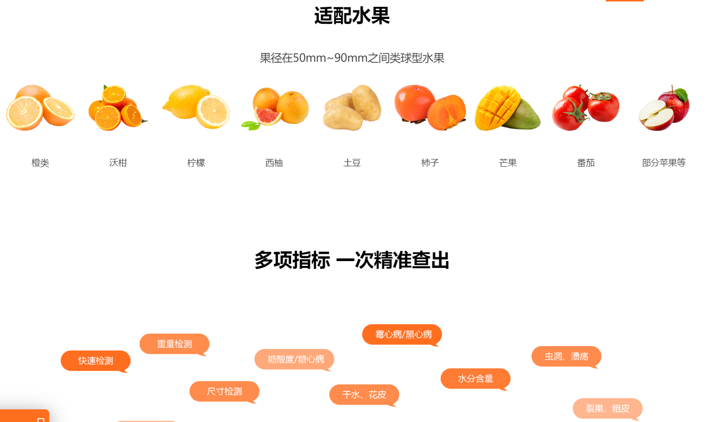
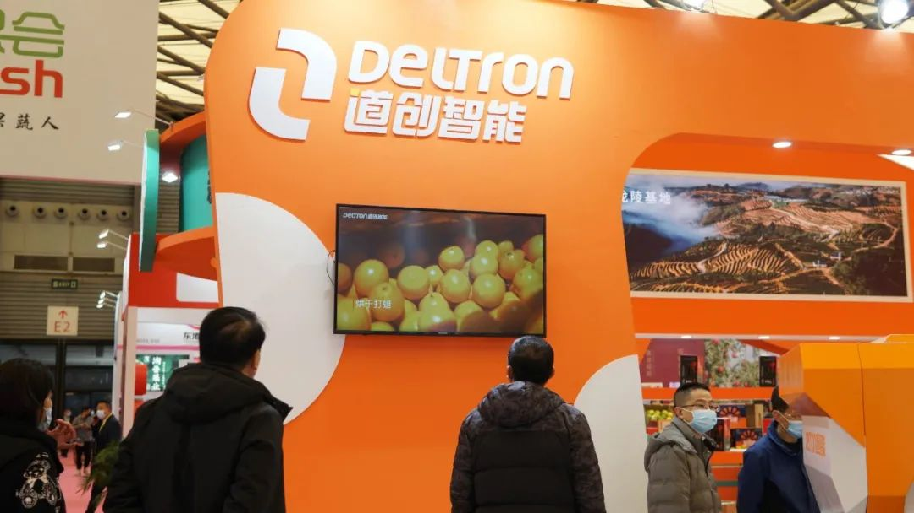
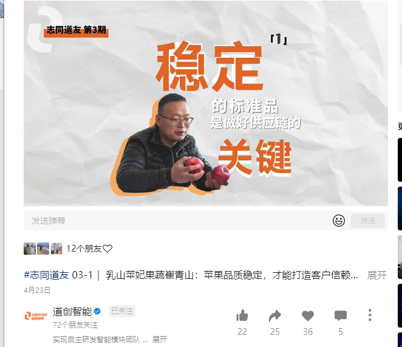

# 林育桦 作品集

# About me

**名字**：林育桦

**别称**：Pinky
**籍贯**：汕头
**住址**：福田区 9号线上

**MBTI**：ENFJ

**星座**：射手座

**身份特征**：\#不传统的潮汕女孩 

\#灵感爆发者

**联系方式**：15858258496（微信同号）

**邮箱**：lin\_yohua@126\.com

# 项目经历

## 01 官网2次升级

介绍：21\-23年参与2次公司官网改版升级，本人负责设计框架架构、风格设定、文案内容、图片素材准备工作

**第1次改版**

1. 强化品牌调性\-更新品牌色彩：公司品牌色从绿改为橙，整体风格得跟着变换

2. 提升用户体验\-框架修改：由原来的2个产品分类改为按产品能分的水果进行分类，便于客户针对性根据水果进入相应的页面

【基于第一次的设计和搭建都是外包的 在做修改的时候会有些不便并且存在安全隐患等其他因素 开始第二次改版】

**第2次改版**

1. 用户体验优化：增加交互体验，如标题过渡效果、图标悬停动画，增加页面的活力和吸引力

2. 内容更新优化：针对公司产品内容的调整，添加新的内容和界面。如增加产品页数、客户案例视频、其他平台链接

工作重点

1. 浏览了同行友商及互联网、汽车品牌等国内外网站，找到适合我司产品及带宽能力的交互方式、设计风格

2. 与研发同事在多项目工作安排下，合理安排时间、推进项目进程

第一版

- 导航栏菜单简单，以文字为主

- 主页内容 展现技术而非产品

第二版

- 导航栏，根据产品类型和水果种类进行分类

- 主页内容 在保留自研技术的同时 讲产品以及功能效果放上去

第三版

- 增加新的板块【新闻资讯】

- 首页增加图片轮播 将案例视频提前

## 02  展会活动情况

介绍：全程参与筹划多场展会，包括3场大型展会（特展）及多场小型展会（标展），负责公司项目展会的整体策划，并落实搭建、相关设计及展出物料、后勤准备。

- 地点：上海新国际博览中心

- 展位面积:96平

- 整体费用：67977（未含展位费）

- 基本信息：公司第一次拿这么大面积特展，现场展示效果不错。关于位置的选择以及亮眼的设计，吸引了很多人。

[21年上海亚果会复盘](https://deltron-tech.feishu.cn/docx/LJtydRBVroSvdMxfPiOcjQgtnce?from=from_copylink) 

- 地点：广州中国进出口商品交易会展馆 

- 展位面积:36平

- 整体费用：11w

- 基本信息：在产品和公司成熟的情况下，加上疫情过后展会复苏，现场效果挺佳。

[9\.1\-3国际水果展复盘](https://deltron-tech.feishu.cn/docx/EA5XdgGS1o1zc5xDviZcobSDnzh?from=from_copylink) 

- 2021 年亚洲果蔬产业博览会

- 2023年第八届中国果业品牌大会

- 2024 年亚洲国际展览会

- 第五届云南果蔬产业大会

- 第五届广西柑橘大会

- 第二十九届杨凌农高会

- 第三十届杨凌农高会

**陕西**

- 第二十九届杨凌农高会

- 第三十届杨凌农高会

**山东**

- 首届智慧农业博览会

**广西**

- 第五届广西柑橘大会

**亚果会和万果会举办的各类会议**

- 2023年第八届中国果业品牌大会

- 第五届云南果蔬产业大会

主要工作内容

- 和展会方联系 选择最佳位置

- 制定宣传物料并落实 为销售同事在前线sale提供弹药支持

## 03 协助媒体采访

介绍：与行业媒体、纸媒、央视有共创内容的经验，包括35斗、亚果会、万果会、深圳新闻网、源码资本等

1. 视频连接：https://tv\.cctv\.cn/2022/06/27/VIDE64kReOKy5yIKBBxWBESz220627\.shtml

2. 项目介绍：配合节目组在云南的拍摄，并负责文字、视频内容创作于官号和行业媒体上发布

3. 相关报道（文字和排版都由本人负责）

- 水果同质化问题如何打破? 果业人的科技盛宴给你答案  https://mp\.weixin\.qq\.com/s/NQmZ704qrrQus\-pz\_ESHSw  

- 水果精细分选难！是什么治愈了果业人的焦虑？  https://mp\.weixin\.qq\.com/s/oaDaOfXS\-VwFrVLUKSxmEQ

- 解密！被央视点赞的水果增值神器！  https://mp\.weixin\.qq\.com/s/Aj5zOUIC1pC\-cWlAmJ3\-NA

4. 相关视频宣传\(脚本、文案由本人负责\)

## 04 内容文案制作及项目宣传

介绍：负责公司早期公众号、视频号、抖音号从0\-1的起步，以及目前产品对外的宣传策划。主要内容是和研发部产品经理建立沟通，将晦涩的产品价值转化为市场价值，并策划相应的视频、彩页、产品手册等线上下宣传物料

1. 公众号（文案及排版）

> 考虑到设备是比较冰冷、大型的形象，以及受众是40\+的中年人为主。因此排版风格简约大方、适当增加动图展示设备同时便于阅读，同时又不能太过于接地气要展示高科技公司的形象。
> 
> 

项目介绍

- 道创技术把关水果标准，让中国苹果走向全球  https://mp\.weixin\.qq\.com/s/6qSPi7Vmmk7exibqYajGGw

- 国产西梅遇上 100%深圳智造，个个佳品！  https://mp\.weixin\.qq\.com/s/f26DeE4I6V0gnn3Vo35mzQ

其他介绍

- 有问必答！关于道创你最关心的那些问题  https://mp\.weixin\.qq\.com/s/oc0zh9zo3E1Py5NZU8fpcw

- 焕新升级，1台智能设备满足5种水果分选  https://mp\.weixin\.qq\.com/s/DY5fcwPHwA22eKEG421\_dQ

- 道创2022｜拥抱变化 坚定前行  https://mp\.weixin\.qq\.com/s/oCNLaRRyYnndhGKPmzQefw

2. 客户采访（编导身份）

> 2b企业可以通过优秀客户案例增加企业的信任度，在工作期间推出【志同道合】计划，每个项目成功落地，都会前往现场和客户1v1交流采访，录制视频。
> 
> 
> 
> 

💙感谢您的浏览！更多问题，可以深聊💙

